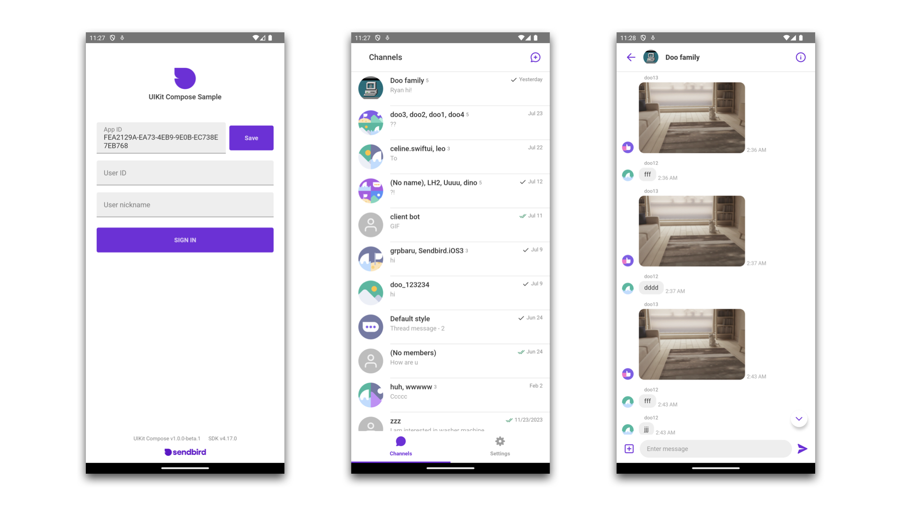

# Sendbird UIKit Sample for Android Jetpack Compose

Sendbird UIKit for Android Jetpack Compose is a development kit with a declarative user interface that enables an easy and fast integration of standard chat features into new or existing client apps. This repository hosts the sample app that demonstrates the usage of Sendbird UIKit for Android Jetpack Compose.

You can find out more about Sendbird UIKit for Android Jetpack Compose at [UIKit for Android Jetpack Compose doc](https://sendbird.com/docs/uikit/v3/jetpack-compose/overview). If you need any help in resolving any issues or have questions, visit [our community](https://community.sendbird.com).

## Screenshots



## How to use the sample app

To open the sample in Android Studio, simply clone the repository.

```
git clone git@github.com:sendbird/sendbird-uikit-sample-android-jetpack-compose.git
```

Then, check out from the main branch and open the `uikit-compose-sample/` directory in Android Studio.

### Try the sample app with your data

If you would like to try the sample app specifically fit to your usage, you can do so by replacing the default sample app ID with yours, which you can obtain by [creating your Sendbird application from the dashboard](https://sendbird.com/docs/chat/v4/android/quickstart/send-first-message#3-install-and-configure-the-chat-sdk-4-step-1-create-a-sendbird-application-from-your-dashboard). Furthermore, you could also add data of your choice on the dashboard to test. This will allow you to experience the sample app with data from your Sendbird application.

## License

```
MIT License

Copyright (c) 2021 Sendbird

Permission is hereby granted, free of charge, to any person obtaining a copy
of this software and associated documentation files (the "Software"), to deal
in the Software without restriction, including without limitation the rights
to use, copy, modify, merge, publish, distribute, sublicense, and/or sell
copies of the Software, and to permit persons to whom the Software is
furnished to do so, subject to the following conditions:

The above copyright notice and this permission notice shall be included in all
copies or substantial portions of the Software.

THE SOFTWARE IS PROVIDED "AS IS", WITHOUT WARRANTY OF ANY KIND, EXPRESS OR
IMPLIED, INCLUDING BUT NOT LIMITED TO THE WARRANTIES OF MERCHANTABILITY,
FITNESS FOR A PARTICULAR PURPOSE AND NONINFRINGEMENT. IN NO EVENT SHALL THE
AUTHORS OR COPYRIGHT HOLDERS BE LIABLE FOR ANY CLAIM, DAMAGES OR OTHER
LIABILITY, WHETHER IN AN ACTION OF CONTRACT, TORT OR OTHERWISE, ARISING FROM,
OUT OF OR IN CONNECTION WITH THE SOFTWARE OR THE USE OR OTHER DEALINGS IN THE
SOFTWARE.
```
